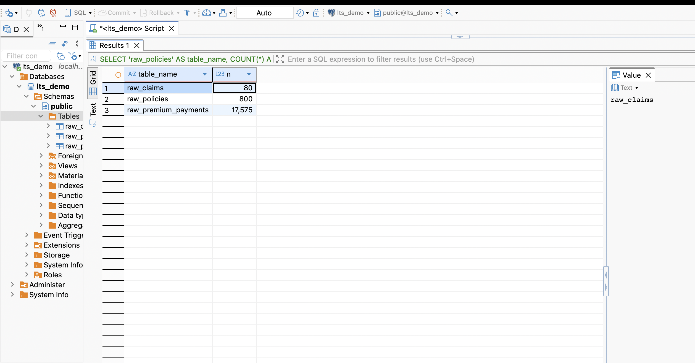
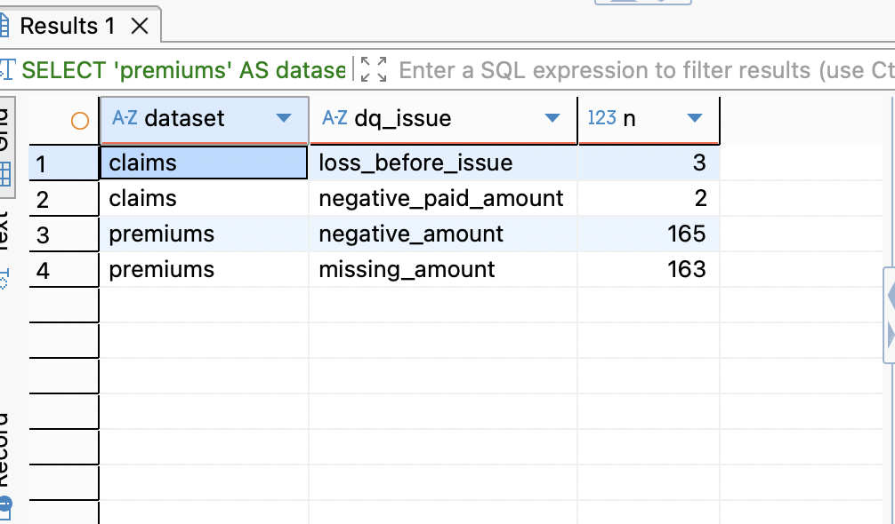
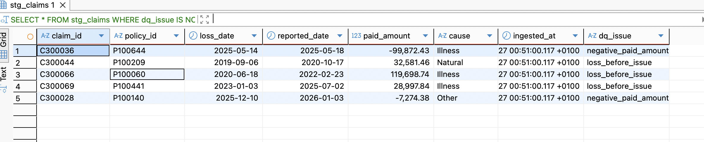
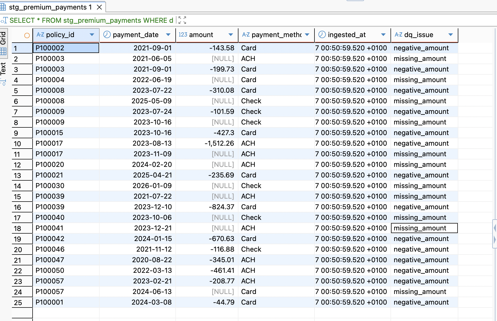
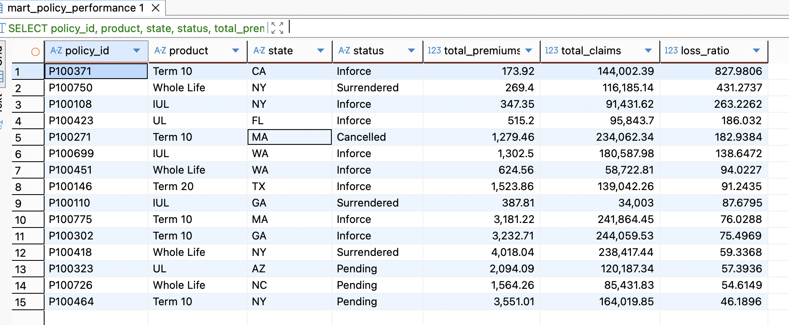

# Milliman LTS Demo (SQL + Data Quality + Marts)

This repo contains a small end-to-end demo of:
- Generating synthetic insurance data (policies, premium payments, claims)
- Loading into Postgres
- Running data-quality checks (flagging bad rows)
- Building analytics marts:
  - policy performance
  - monthly trends

## Repo structure
- `src/` — Python scripts (data generation + ingestion)
- `sql/` — SQL scripts to create staging + marts
- `data_raw/` — generated raw files (CSV/JSON)
- `screenshots/` — query results used as evidence / deliverables
- `outputs/` — any exported results (optional)

## Quickstart
### 1) Start Postgres
```bash
docker compose up -d

## Screenshots (evidence)
### Raw load validation


### Data quality summary


### Example flagged rows



### Gold marts



## SQL
All transformations and mart builds are in:
- `sql/pipeline.sql`


